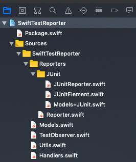
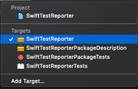
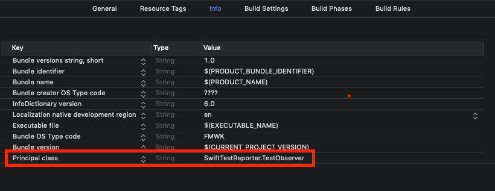

# Swift Test Reporter


A Swift library for creating JUnit XML test results that can be interpreted by tools such as Bamboo or Jenkins.

Sample output:

```
<?xml version="1.0" encoding="UTF-8"?>
<testsuites>
  <testsuite tests="2" failures="0" disabled="0" errors="0" time="0.0013051033020019531" name="JUnitReporterTests">
    <testcase classname="SwiftTestReporterTests.JUnitReporterTests" name="testReporterShouldReturnXMLForEmptySuite" time="0.0007890462875366211"></testcase>
    <testcase classname="SwiftTestReporterTests.JUnitReporterTests" name="testReporterShouldReturnXMLForFailedTest" time="0.000516057014465332"></testcase>
  </testsuite>
  <testsuite tests="1" failures="1" disabled="0" errors="0" time="0.00021898746490478516" name="UtilsTests">
    <testcase classname="SwiftTestReporterTests.UtilsTests" name="testShouldReturnProperlyClassName" time="0.00021898746490478516">
      <failure message="Oh no!!"></failure>
    </testcase>
  </testsuite>
</testsuites>
```

# How to use it?
## Linux
Add ``SwiftTestReporter`` to ``Package.swift``:

```
import PackageDescription

let package = Package(
  dependencies: [
    ...
    .package(url: "https://github.com/allegro/swift-junit.git", from: "2.0.0"),
    // or for Swift 4.x
    // .package(url: "https://github.com/allegro/swift-junit.git", from: .upToNextMajor(from: "1.0.0")),
                
  ]
  ...
  targets: [
    ...
    .testTarget(
      name: "AppTests",
      dependencies: [
        "App",
        "SwiftTestReporter"
      ]
    ),
  ]
)
```

Next, add:
```
import SwiftTestReporter

_ = TestObserver()
```
To ``LinuxMain.swift``. Done.

## XCode
In ``Project Navigator``, select particular project:



Next, select test target:



Add a new property named ``Principal class`` and set it to ``SwiftTestReporter.TestObserver``


